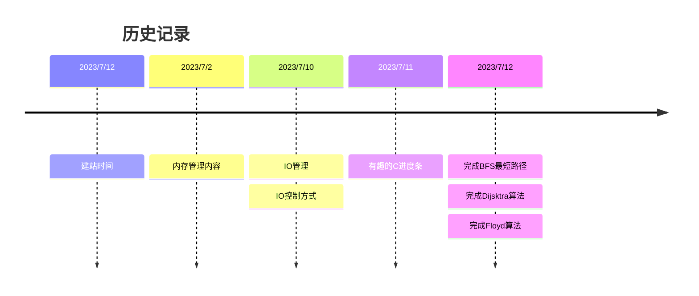

## TODO

- IO管理 设备分配的几种表
- 进程调度算法

## 历史记录

```mermaid
timeline
    title 历史记录
    2023/7/12: 建站时间
    2023/7/2 : 内存管理内容
    2023/7/10 :  IO管理
    		  :  IO控制方式
    2023/7/11 :  有趣的C进度条
    2023/7/12 : 完成BFS最短路径
    		  : 完成Dijsktra算法
              : 完成Floyd算法
              
```

