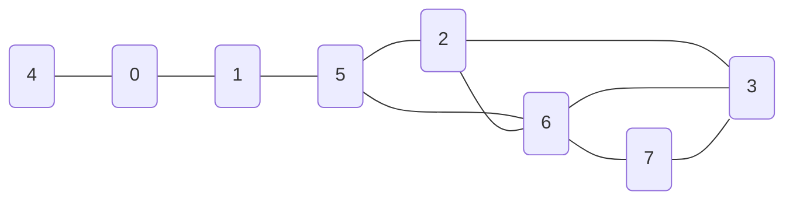
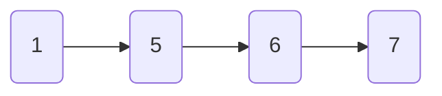

import Tabs from '@theme/Tabs';
import TabItem from '@theme/TabItem';


## 🍉BFS最短路径算法 

### 基础函数


<Tabs>

<TabItem value="图声明" label="图声明">

```cpp
#include <stdio.h>
#include <queue>
#include <stack>
int visited[100];
int distance[100];
int path[100];


typedef struct {
	int edge[100][100];
	int vexnum;
	int arcnum;
}Graph;
```

</TabItem>


<TabItem value="第一个相邻结点" label="第一个相邻结点">

```cpp
int firstNeighbor(Graph G, int w) {
	for (int i = 0; i < G.vexnum; i++) {
		if (G.edge[w][i]&&i!=w) {
			return i;
		}
	}
	return -1;
}
```

</TabItem>
<TabItem value="后继相邻结点" label="后继相邻结点">

```cpp
int nextNeighbor(Graph G, int w,int last) {
	for (int i = last+1; i < G.vexnum; i++) {
		if (G.edge[w][i] && i != w) {
			return i;
		}
	}
	return -1;
}
```

</TabItem>

<TabItem value="图初始化" label="图初始化">

```cpp
void init(Graph G) {
	for (int i = 0; i < G.vexnum; i++) {
		visited[i] = 0;
		distance[i] = 1e9;
		path[i] = -1;
	}
}
```

</TabItem>

<TabItem value="邻接矩阵初始化" label="邻接矩阵初始化">

```cpp
void init_Graph(Graph *G) {
	G->edge[0][0] = 0; G->edge[1][0] = 1; G->edge[2][0] = 0; G->edge[3][0] = 0; G->edge[4][0] = 1; G->edge[5][0] = 0; G->edge[6][0] = 0; G->edge[7][0] = 0;
	G->edge[0][1] = 1; G->edge[1][1] = 0; G->edge[2][1] = 0; G->edge[3][1] = 0; G->edge[4][1] = 0; G->edge[5][1] = 1; G->edge[6][1] = 0; G->edge[7][1] = 0;
	G->edge[0][2] = 0; G->edge[1][2] = 0; G->edge[2][2] = 0; G->edge[3][2] = 1; G->edge[4][2] = 0; G->edge[5][2] = 2; G->edge[6][2] = 1; G->edge[7][2] = 0;
	G->edge[0][3] = 0; G->edge[1][3] = 0; G->edge[2][3] = 1; G->edge[3][3] = 0; G->edge[4][3] = 0; G->edge[5][3] = 0; G->edge[6][3] = 1; G->edge[7][3] = 1;
	G->edge[0][4] = 1; G->edge[1][4] = 0; G->edge[2][4] = 0; G->edge[3][4] = 0; G->edge[4][4] = 0; G->edge[5][4] = 0; G->edge[6][4] = 0; G->edge[7][4] = 0;
	G->edge[0][5] = 0; G->edge[1][5] = 1; G->edge[2][5] = 1; G->edge[3][5] = 0; G->edge[4][5] = 0; G->edge[5][5] = 0; G->edge[6][5] = 1; G->edge[7][5] = 0;
	G->edge[0][6] = 0; G->edge[1][6] = 0; G->edge[2][6] = 1; G->edge[3][6] = 1; G->edge[4][6] = 0; G->edge[5][6] = 1; G->edge[6][6] = 0; G->edge[7][6] = 1;
	G->edge[0][7] = 0; G->edge[1][7] = 0; G->edge[2][7] = 0; G->edge[3][7] = 1; G->edge[4][7] = 0; G->edge[5][7] = 0; G->edge[6][7] = 1; G->edge[7][7] = 0;
}
```
</TabItem>
</Tabs>

### 核心算法
<Tabs>
<TabItem value="BFS最短路径" label="BFS最短路径">

```cpp
void BFS_shortestPath(Graph G,int first) {
	//初始化部分
	std::queue<int> q;
	visited[first] = 1;
	distance[first] = 0;
	q.push(first);
	while (!q.empty()) {
		int current = q.front();
		q.pop();
		for (int w = firstNeighbor(G, current); w >= 0; w = nextNeighbor(G, current, w)) {
			if (!visited[w]) {
				q.push(w);
				visited[w] = 1;
				distance[w] = distance[current] + 1;
				path[w] = current;
			}
		}
	}
}
```
</TabItem>
<TabItem value="主函数" label="主函数">

```cpp
int main() {
	Graph G;
	G.vexnum = 8;
	G.arcnum = 10;
	init(G);
	init_Graph(&G);
	BFS_shortestPath(G, 1);
	int re = 4;//要访问的顶点
	printf("从1号顶点到%d顶点距离为%d\n", re, distance[re]);
	printf("路径为-> ");
	std::stack<int> s;

	while (path[re] != -1) {
		s.push(re);
		re = path[re];
	}
	s.push(1);
	while (!s.empty()) {
		printf("%d ", s.top());
		s.pop();
	}

}
```
</TabItem>
</Tabs>


### 输出

<Tabs>
<TabItem value="图可视化" label="图可视化">



</TabItem>

<TabItem value="目标:7" label="目标:7">

```txt
从1号顶点到7顶点距离为3
路径为-> 1 5 6 7
```
</TabItem>

<TabItem value="结果可视化" label="结果可视化">



</TabItem>
</Tabs>

## 🍭Dijskstra 算法

## 🍓Floyd 算法