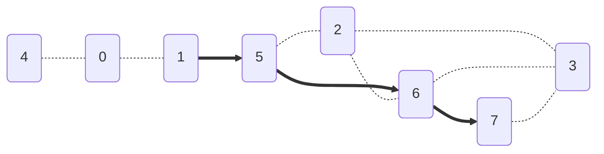
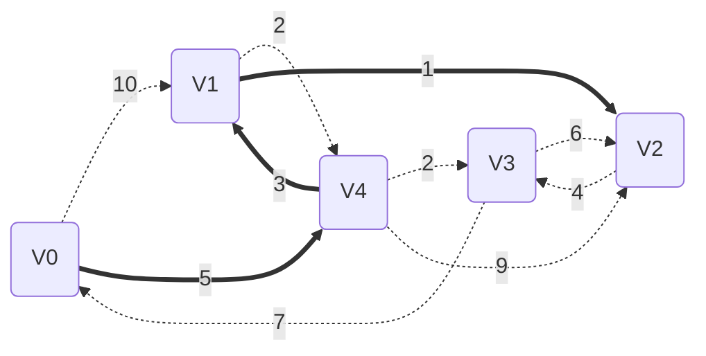
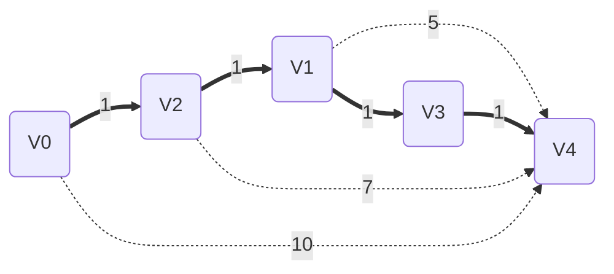

import Tabs from '@theme/Tabs';
import TabItem from '@theme/TabItem';

### 基础函数(公共)
<Tabs>
<TabItem value="图声明" label="图声明">

```cpp
#include <stdio.h>
#include <queue>
#include <math.h>

//全局变量-------------------------
int visited[100];		//用于BFS算法
double distance[100];
int path[100];
bool final[100];		//用于Dijsktra算法
//-------------------------------

//图的信息-------------------------
double edge[100][100];  //邻接矩阵
int vexnum; 			//顶点个数
int arcnum;             //边个数
//--------------------------------
```
</TabItem>
<TabItem value="第一个相邻结点" label="第一个相邻结点">

```cpp
//基础函数-------------------------
int firstNeighbor(const int w) {
	for (int i = 0; i < vexnum; i++) {
		if (edge[w][i] > 0 && edge[w][i] < INFINITY && i != w) {
			return i;
		}
	}
	return -1;
}
```
</TabItem>
<TabItem value="后继相邻结点" label="后继相邻结点">

```cpp
int nextNeighbor(const int w, const int last) {
	for (int i = last + 1; i < vexnum; i++) {
		if (edge[w][i] > 0 && edge[w][i] < INFINITY && i != w) {
			return i;
		}
	}
	return -1;
}
```
</TabItem>
<TabItem value="测试函数" label="测试函数">

```cpp
void test(void(*func)(const int first)) {
	vexnum = 8;
	arcnum = 10;
	init();
	int start = 0;
	int destination = 2;//要访问的顶点
	func(start);
	printf("从%d号顶点到%d顶点距离为%.0f\n", start, destination, distance[destination]);
	printf("路径为-> ");
	std::stack<int> s;
	while (path[destination] != -1) {
		s.push(destination);
		destination = path[destination];
	}
	s.push(start);
	while (!s.empty()) {
		printf("%d ", s.top());
		s.pop();
	}
}
```
</TabItem>
</Tabs>

## 🍉BFS最短路径算法 

### 核心算法
<Tabs>
<TabItem value="BFS最短路径" label="BFS最短路径">

```cpp
void BFS_shortestPath( const int first) {
	//初始化部分
	std::queue<int> q;
	visited[first] = 1;
	distance[first] = 0;
	q.push(first);
	while (!q.empty()) {
		int current = q.front();
		q.pop();
		for (int w = firstNeighbor( current); w >= 0; w = nextNeighbor(current, w)) {
			if (!visited[w]) {
				q.push(w);
				visited[w] = 1;
				distance[w] = distance[current] + 1;
				path[w] = current;
			}
		}
	}
}
```
</TabItem>
<TabItem value="图初始化" label="图初始化">

```cpp
void init() {
	for (int i = 0; i < vexnum; i++) {
		visited[i]  = 0;
		distance[i] = INFINITY;
		path[i]     = -1;
		final[i]    = false; //用于dijsktra算法
	}

	edge[0][0] = 0; edge[1][0] = 1; edge[2][0] = 0; edge[3][0] = 0; edge[4][0] = 1; edge[5][0] = 0; edge[6][0] = 0; edge[7][0] = 0;
	edge[0][1] = 1; edge[1][1] = 0; edge[2][1] = 0; edge[3][1] = 0; edge[4][1] = 0; edge[5][1] = 1; edge[6][1] = 0; edge[7][1] = 0;
	edge[0][2] = 0; edge[1][2] = 0; edge[2][2] = 0; edge[3][2] = 1; edge[4][2] = 0; edge[5][2] = 2; edge[6][2] = 1; edge[7][2] = 0;
	edge[0][3] = 0; edge[1][3] = 0; edge[2][3] = 1; edge[3][3] = 0; edge[4][3] = 0; edge[5][3] = 0; edge[6][3] = 1; edge[7][3] = 1;
	edge[0][4] = 1; edge[1][4] = 0; edge[2][4] = 0; edge[3][4] = 0; edge[4][4] = 0; edge[5][4] = 0; edge[6][4] = 0; edge[7][4] = 0;
	edge[0][5] = 0; edge[1][5] = 1; edge[2][5] = 1; edge[3][5] = 0; edge[4][5] = 0; edge[5][5] = 0; edge[6][5] = 1; edge[7][5] = 0;
	edge[0][6] = 0; edge[1][6] = 0; edge[2][6] = 1; edge[3][6] = 1; edge[4][6] = 0; edge[5][6] = 1; edge[6][6] = 0; edge[7][6] = 1;
	edge[0][7] = 0; edge[1][7] = 0; edge[2][7] = 0; edge[3][7] = 1; edge[4][7] = 0; edge[5][7] = 0; edge[6][7] = 1; edge[7][7] = 0;

}
```
</TabItem>
</Tabs>

### 输出
<Tabs>
<TabItem value="图可视化" label="图可视化">


</TabItem>
</Tabs>

## 🍭Dijskstra 算法

### 核心算法
<Tabs>
<TabItem value="核心算法" label="核心算法">

```cpp
void dijsktra( const int first) {
	//初始化阶段
	int full = vexnum;	//final数组是否全部为true的标志
	distance[first] = 0;
	int current=-1;
	//在当前final值为false对应的distance元素中找到最小值
	while (full) {
		double min = INFINITY;
		for (int i = 0; i < vexnum; i++) {
			if (!final[i]) {
				if (distance[i] <= min) {
					min = distance[i];
					current = i;
				}
			}
		}
		
		if (current >= 0 && current < vexnum) {
			final[current] = true;
			full--;
		}

		for (int w = firstNeighbor(current); w >= 0; w = nextNeighbor( current, w)) {
			if (distance[w] > edge[current][w] + distance[current]) {
				distance[w] = edge[current][w] + distance[current];
				path[w] = current;
			}
			
		}
	}
}
```
</TabItem>
<TabItem value="图初始化" label="图初始化">

```cpp
void init() {
	for (int i = 0; i < vexnum; i++) {
		visited[i]  = 0;
		distance[i] = INFINITY;
		path[i]     = -1;
		final[i]    = false; //用于dijsktra算法
	}
	//Dijsktra
	edge[0][0] = 0;		   edge[1][0] = INFINITY; edge[2][0] = INFINITY; edge[3][0] = 7;	    edge[4][0] = 5;
	edge[0][1] = 10;	   edge[1][1] = 0;		  edge[2][1] = INFINITY; edge[3][1] = INFINITY; edge[4][1] = 3;
	edge[0][2] = INFINITY; edge[1][2] = 1;		  edge[2][2] = 0;	     edge[3][2] = 6;		edge[4][2] = 9; 
	edge[0][3] = INFINITY; edge[1][3] = INFINITY; edge[2][3] = 4;		 edge[3][3] = 0;		edge[4][3] = 2;
	edge[0][4] = 5;		   edge[1][4] = 5;        edge[2][4] = INFINITY; edge[3][4] = INFINITY; edge[4][4] = 0;
}
```
</TabItem>
</Tabs>

### 输出
<Tabs>
<TabItem value="目标: 2" label="目标: 2">


</TabItem>
</Tabs>

## 🍓Floyd 算法

### 核心算法
<Tabs>
<TabItem value="核心算法" label="核心算法">

```cpp
void floyd() {
	for (int k = 0; k < vexnum; k++) {
		for (int i = 0; i < vexnum; i++) {
			for (int j = 0; j < vexnum; j++) {
				if (dist[i][j] > dist[i][k] + dist[k][j]) {
					dist[i][j] = dist[i][k] + dist[k][j];
					pathf[i][j] = k;
				}
			}
		}
	}
}
```
</TabItem>
<TabItem value="全局变量及递归函数" label="全局变量及递归函数">

```cpp
#include <stdio.h>
#include <math.h>

double  dist [5][5]; 	//用于floyd算法
int 	pathf[5][5];    //用于floyd算法

void outpathf(int start,int desination) {
	if (pathf[start][desination] != -1) {
		outpathf(start, pathf[start][desination]);

		printf("%d ", pathf[start][desination]);
		
		outpathf(pathf[start][desination], desination);	
	}
	else {
		return;
	}
}
```
</TabItem>
<TabItem value="图初始化" label="图初始化">

```cpp
void init() {
	dist[0][0] = 0;		   dist[1][0] = INFINITY; dist[2][0] = INFINITY; dist[3][0] = INFINITY; dist[4][0] = INFINITY;
	dist[0][1] = INFINITY; dist[1][1] = 0;		  dist[2][1] = 1;        dist[3][1] = INFINITY; dist[4][1] = INFINITY;
	dist[0][2] = 1;		   dist[1][2] = INFINITY; dist[2][2] = 0;	     dist[3][2] = INFINITY; dist[4][2] = INFINITY;
	dist[0][3] = INFINITY; dist[1][3] = 1;        dist[2][3] = INFINITY; dist[3][3] = 0;		dist[4][3] = INFINITY;
	dist[0][4] = 10;	   dist[1][4] = 5;        dist[2][4] = 7;	     dist[3][4] = 1;        dist[4][4] = 0;

	for (int i = 0; i < vexnum; i++) {
		for (int j = 0; j < vexnum; j++) {
			pathf[i][j] = -1;
		}
	}
}
```
</TabItem>
</Tabs>

### 输出
<Tabs>
<TabItem value="测试函数" label="测试函数">

**起始顶点为V0，目的顶点为V4**

```cpp
void testf() {
	vexnum = 5;
	arcnum = 7;
	init();
	int start	    = 0;      //起始顶点
	int destination = 4;      //要访问的顶点
	floyd();
	printf("从%d号顶点到%d顶点距离为%.0f\n", start, destination, dist[start][destination]);
	printf("路径为-> ");
	printf("%d ", start);
	outpathf(start, destination);
	printf("%d ", destination);
}
```
</TabItem>
<TabItem value="结果" label="结果">


</TabItem>
</Tabs>